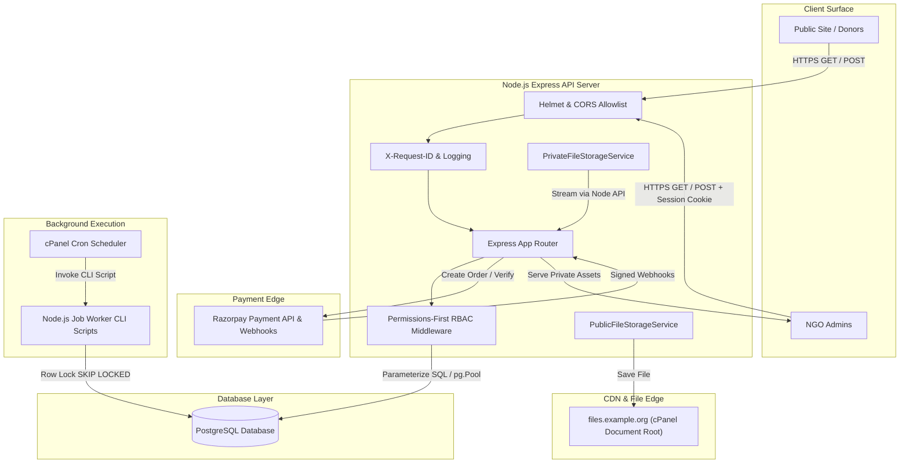
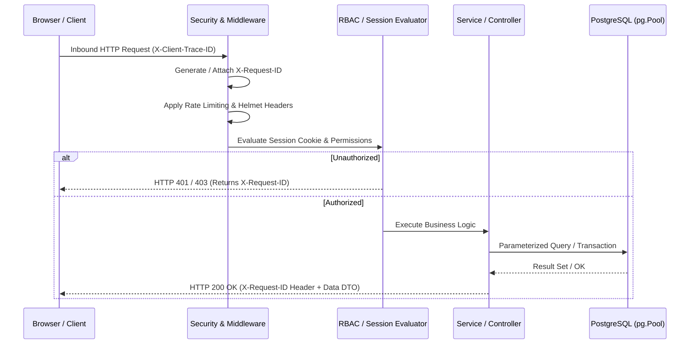

# 01 — System Architecture & Topology

**Project:** Help A Mission Welfare Society — Backend API  
**Version:** Base v0.6  
**Status:** Approved Technical Architecture  

---

## 1. Technical Baseline & Runtime

- **Runtime Environment:** Node.js `24.21.0`
- **Application Framework:** Express.js (ES Modules / TypeScript)
- **Primary Database:** PostgreSQL (administered via pgAdmin)
- **Database Driver:** `pg` (`node-postgres`) using `Pool` connection management; no ORM
- **Frontend Stack:** React + Vite + TypeScript + Tailwind CSS + Redux Toolkit & RTK Query
- **Payment Processing:** Razorpay (order creation, raw-body HMAC webhook signature verification, reconciliation)
- **Hosting Platform:** Namecheap Web Hosting with cPanel management
- **Storage Strategy:** Server local filesystem (`public_files` subdomain for public assets; private directory outside web root for reports/receipts)
- **Job Execution:** cPanel Cron Jobs invoking Node.js CLI worker scripts backed by PostgreSQL job state (No Redis)
- **Session Architecture:** Opaque PostgreSQL-backed server sessions stored in `HttpOnly`, `Secure`, `SameSite=Strict` cookies

---

## 2. High-Level Architecture Diagram



---

## 3. Storage & Deployment Boundaries

The server filesystem is partitioned into strict, non-overlapping zones:

```text
/home/<cpanel_account>/
├── app/
│   └── backend/                # Express API application codebase
├── storage/
│   └── private/                # Private asset root (OUTSIDE web root)
│       ├── reports/            # Exported financial reports (CSV / PDF)
│       ├── receipts/           # System-generated donation receipts
│       ├── exports/            # System data exports
│       └── internal/           # Operational backups & logs
└── public_files/               # Public asset root (Mapped to files.example.org)
    ├── images/                 # Banner & hero images
    ├── gallery/                # High-res gallery uploads
    ├── initiatives/            # Project / campaign cover media
    └── documents/              # Intentionally published public PDFs
```

### Critical Storage Rules
1. `public_files/` is the document root for `files.example.org`. Web browsers access files directly without Node.js involvement.
2. `storage/private/` is placed completely outside all web roots (`public_html` and `public_files`). It is **never** accessible directly via a browser URL.
3. Private file delivery is handled exclusively by Express routes after verifying session authentication and explicit permission checks.

---

## 4. Request Lifecycle & Tracing

Every inbound request flows through the standard security pipeline:



### Response Header Standards
- `X-Request-ID`: Server-generated UUID identifying the unique request instance across logs and audit events.
- `Cache-Control`: `no-store, no-cache, must-revalidate` on all sensitive portal and admin endpoints.

---

## 5. Environment Configuration & Bootstrap

Application configuration is loaded strictly at startup. If required variables are missing or malformed, the process exits immediately (`process.exit(1)`).

### Essential Keys
- `PORT`: Server listening port (default: `5000`)
- `NODE_ENV`: `development` | `production` | `test`
- `DATABASE_URL` / `PGHOST`, `PGPORT`, `PGDATABASE`, `PGUSER`, `PGPASSWORD`: PostgreSQL connection parameters
- `RAZORPAY_KEY_ID`, `RAZORPAY_KEY_SECRET`, `RAZORPAY_WEBHOOK_SECRET`: Payment gateway credentials
- `PUBLIC_UPLOAD_ROOT`: Absolute server path to public asset folder (`/home/<account>/public_files`)
- `PUBLIC_UPLOAD_BASE_URL`: Public asset CDN URL (`https://files.example.org`)
- `PRIVATE_UPLOAD_ROOT`: Absolute path to private storage (`/home/<account>/storage/private`)
- `SESSION_SECRET`: Cryptographic key for signing session identifiers
- `ORGANIZATION_TIMEZONE`: Timezone for reporting and scheduler (default: `Asia/Kolkata`)
