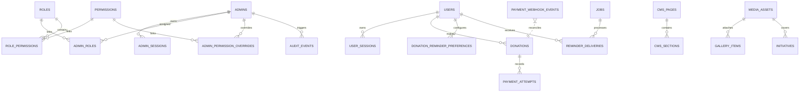

# 02 — Database ERD & Schema Specification

**Project:** Help A Mission Welfare Society — Backend API  
**Engine:** PostgreSQL  
**Driver:** `pg` (`node-postgres`) using `pg.Pool`  

---

## 1. Relational Entity Relationship Diagram



---

## 2. Table Specifications

### 2.1 Security & Admin Tables

#### Table: `admins`
Stores administrative accounts.
```sql
CREATE TABLE admins (
    id UUID PRIMARY KEY DEFAULT gen_random_uuid(),
    email VARCHAR(255) NOT NULL,
    email_normalized VARCHAR(255) UNIQUE NOT NULL,
    password_hash VARCHAR(255) NOT NULL,
    password_algorithm VARCHAR(32) NOT NULL DEFAULT 'argon2id',
    mfa_enabled BOOLEAN NOT NULL DEFAULT false,
    mfa_secret_encrypted TEXT,
    status VARCHAR(32) NOT NULL DEFAULT 'active' CHECK (status IN ('active', 'disabled', 'pending_setup')),
    authz_version INT NOT NULL DEFAULT 1,
    last_login_at TIMESTAMPTZ,
    created_at TIMESTAMPTZ NOT NULL DEFAULT CURRENT_TIMESTAMP,
    updated_at TIMESTAMPTZ NOT NULL DEFAULT CURRENT_TIMESTAMP
);
```

#### Table: `admin_sessions`
Active opaque server sessions for admins.
```sql
CREATE TABLE admin_sessions (
    id UUID PRIMARY KEY DEFAULT gen_random_uuid(),
    admin_id UUID NOT NULL REFERENCES admins(id) ON DELETE CASCADE,
    session_token_hash VARCHAR(64) UNIQUE NOT NULL,
    device_id VARCHAR(128) NOT NULL,
    user_agent TEXT,
    ip_address VARCHAR(45),
    created_at TIMESTAMPTZ NOT NULL DEFAULT CURRENT_TIMESTAMP,
    last_seen_at TIMESTAMPTZ NOT NULL DEFAULT CURRENT_TIMESTAMP,
    expires_at TIMESTAMPTZ NOT NULL,
    revoked_at TIMESTAMPTZ,
    revocation_reason VARCHAR(128)
);
CREATE INDEX idx_admin_sessions_admin_id ON admin_sessions(admin_id);
CREATE INDEX idx_admin_sessions_token_hash ON admin_sessions(session_token_hash);
```

### 2.2 Permissions-First RBAC Model

#### Table: `roles`
Dynamic role bundles.
```sql
CREATE TABLE roles (
    id UUID PRIMARY KEY DEFAULT gen_random_uuid(),
    key VARCHAR(64) UNIQUE NOT NULL,
    name VARCHAR(128) NOT NULL,
    description TEXT,
    is_system BOOLEAN NOT NULL DEFAULT false,
    is_active BOOLEAN NOT NULL DEFAULT true,
    created_at TIMESTAMPTZ NOT NULL DEFAULT CURRENT_TIMESTAMP,
    updated_at TIMESTAMPTZ NOT NULL DEFAULT CURRENT_TIMESTAMP
);
```

#### Table: `permissions`
Authoritative granular permission registry.
```sql
CREATE TABLE permissions (
    id UUID PRIMARY KEY DEFAULT gen_random_uuid(),
    key VARCHAR(64) UNIQUE NOT NULL,
    module VARCHAR(64) NOT NULL,
    description TEXT,
    is_active BOOLEAN NOT NULL DEFAULT true,
    created_at TIMESTAMPTZ NOT NULL DEFAULT CURRENT_TIMESTAMP
);
```

#### Table: `role_permissions`
Join table mapping permissions to roles.
```sql
CREATE TABLE role_permissions (
    role_id UUID NOT NULL REFERENCES roles(id) ON DELETE CASCADE,
    permission_id UUID NOT NULL REFERENCES permissions(id) ON DELETE CASCADE,
    PRIMARY KEY (role_id, permission_id)
);
```

#### Table: `admin_roles`
Join table mapping accounts to roles.
```sql
CREATE TABLE admin_roles (
    admin_id UUID NOT NULL REFERENCES admins(id) ON DELETE CASCADE,
    role_id UUID NOT NULL REFERENCES roles(id) ON DELETE RESTRICT,
    PRIMARY KEY (admin_id, role_id)
);
```

#### Table: `admin_permission_overrides`
Per-account allow/deny permission overrides.
```sql
CREATE TABLE admin_permission_overrides (
    admin_id UUID NOT NULL REFERENCES admins(id) ON DELETE CASCADE,
    permission_id UUID NOT NULL REFERENCES permissions(id) ON DELETE CASCADE,
    effect VARCHAR(8) NOT NULL CHECK (effect IN ('allow', 'deny')),
    PRIMARY KEY (admin_id, permission_id)
);
```

---

### 2.3 User & Donor Tables

#### Table: `users`
Donor identity records.
```sql
CREATE TABLE users (
    id UUID PRIMARY KEY DEFAULT gen_random_uuid(),
    email VARCHAR(255) NOT NULL,
    email_normalized VARCHAR(255) UNIQUE NOT NULL,
    phone VARCHAR(32),
    phone_normalized VARCHAR(32),
    name VARCHAR(255) NOT NULL,
    status VARCHAR(32) NOT NULL DEFAULT 'active' CHECK (status IN ('active', 'disabled')),
    email_verified_at TIMESTAMPTZ,
    phone_verified_at TIMESTAMPTZ,
    created_source VARCHAR(32) NOT NULL CHECK (created_source IN ('signup', 'donation')),
    created_at TIMESTAMPTZ NOT NULL DEFAULT CURRENT_TIMESTAMP,
    updated_at TIMESTAMPTZ NOT NULL DEFAULT CURRENT_TIMESTAMP
);
CREATE UNIQUE INDEX idx_users_phone_normalized ON users(phone_normalized) WHERE phone_normalized IS NOT NULL;
```

#### Table: `user_sessions`
Donor portal opaque sessions.
```sql
CREATE TABLE user_sessions (
    id UUID PRIMARY KEY DEFAULT gen_random_uuid(),
    user_id UUID NOT NULL REFERENCES users(id) ON DELETE CASCADE,
    session_token_hash VARCHAR(64) UNIQUE NOT NULL,
    device_id VARCHAR(128) NOT NULL,
    user_agent TEXT,
    ip_address VARCHAR(45),
    created_at TIMESTAMPTZ NOT NULL DEFAULT CURRENT_TIMESTAMP,
    last_seen_at TIMESTAMPTZ NOT NULL DEFAULT CURRENT_TIMESTAMP,
    expires_at TIMESTAMPTZ NOT NULL,
    revoked_at TIMESTAMPTZ
);
```

---

### 2.4 Donations & Payment Tables

#### Table: `donations`
Financial donation records. Amounts stored strictly in minor units (paise).
```sql
CREATE TABLE donations (
    id UUID PRIMARY KEY DEFAULT gen_random_uuid(),
    user_id UUID NOT NULL REFERENCES users(id) ON DELETE RESTRICT,
    amount_minor BIGINT NOT NULL CHECK (amount_minor > 0),
    currency VARCHAR(3) NOT NULL DEFAULT 'INR',
    status VARCHAR(32) NOT NULL DEFAULT 'initiated' CHECK (status IN ('initiated', 'order_created', 'authorized', 'captured', 'failed', 'cancelled', 'refunded', 'partially_refunded')),
    message TEXT,
    razorpay_order_id VARCHAR(128),
    razorpay_payment_id VARCHAR(128),
    payment_method_summary VARCHAR(64),
    paid_at TIMESTAMPTZ,
    refunded_amount_minor BIGINT NOT NULL DEFAULT 0 CHECK (refunded_amount_minor >= 0),
    created_at TIMESTAMPTZ NOT NULL DEFAULT CURRENT_TIMESTAMP,
    updated_at TIMESTAMPTZ NOT NULL DEFAULT CURRENT_TIMESTAMP
);
CREATE INDEX idx_donations_user_id ON donations(user_id, created_at DESC);
CREATE INDEX idx_donations_status_paid ON donations(status, paid_at DESC);
CREATE UNIQUE INDEX idx_donations_rzp_order_id ON donations(razorpay_order_id) WHERE razorpay_order_id IS NOT NULL;
CREATE UNIQUE INDEX idx_donations_rzp_payment_id ON donations(razorpay_payment_id) WHERE razorpay_payment_id IS NOT NULL;
```

#### Table: `payment_attempts`
Log of individual gateway attempts.
```sql
CREATE TABLE payment_attempts (
    id UUID PRIMARY KEY DEFAULT gen_random_uuid(),
    donation_id UUID NOT NULL REFERENCES donations(id) ON DELETE CASCADE,
    provider VARCHAR(32) NOT NULL DEFAULT 'razorpay',
    provider_order_id VARCHAR(128) NOT NULL,
    provider_payment_id VARCHAR(128),
    status VARCHAR(32) NOT NULL,
    failure_code VARCHAR(64),
    failure_description_sanitized TEXT,
    created_at TIMESTAMPTZ NOT NULL DEFAULT CURRENT_TIMESTAMP
);
```

#### Table: `payment_webhook_events`
Raw webhook deduplication table.
```sql
CREATE TABLE payment_webhook_events (
    id UUID PRIMARY KEY DEFAULT gen_random_uuid(),
    provider_event_id VARCHAR(128) UNIQUE NOT NULL,
    event_type VARCHAR(64) NOT NULL,
    signature_verified BOOLEAN NOT NULL,
    payload_hash VARCHAR(64) NOT NULL,
    processing_status VARCHAR(32) NOT NULL DEFAULT 'pending' CHECK (processing_status IN ('pending', 'processed', 'failed', 'ignored')),
    error_sanitized TEXT,
    received_at TIMESTAMPTZ NOT NULL DEFAULT CURRENT_TIMESTAMP,
    processed_at TIMESTAMPTZ
);
```

---

### 2.5 CMS & Media Tables

#### Table: `media_assets`
```sql
CREATE TABLE media_assets (
    id UUID PRIMARY KEY DEFAULT gen_random_uuid(),
    visibility VARCHAR(16) NOT NULL CHECK (visibility IN ('public', 'private')),
    storage_type VARCHAR(32) NOT NULL CHECK (storage_type IN ('local_public', 'local_private')),
    relative_path TEXT NOT NULL,
    public_url TEXT,
    mime_type VARCHAR(128) NOT NULL,
    size_bytes BIGINT NOT NULL,
    sha256 VARCHAR(64) NOT NULL,
    width INT,
    height INT,
    uploaded_by UUID REFERENCES admins(id) ON DELETE SET NULL,
    created_at TIMESTAMPTZ NOT NULL DEFAULT CURRENT_TIMESTAMP
);
```

#### Table: `cms_pages` & `cms_sections`
```sql
CREATE TABLE cms_pages (
    id UUID PRIMARY KEY DEFAULT gen_random_uuid(),
    slug VARCHAR(128) UNIQUE NOT NULL,
    title VARCHAR(255) NOT NULL,
    status VARCHAR(32) NOT NULL DEFAULT 'draft' CHECK (status IN ('draft', 'published', 'archived')),
    seo_json JSONB,
    created_by UUID REFERENCES admins(id),
    updated_by UUID REFERENCES admins(id),
    created_at TIMESTAMPTZ NOT NULL DEFAULT CURRENT_TIMESTAMP,
    updated_at TIMESTAMPTZ NOT NULL DEFAULT CURRENT_TIMESTAMP
);

CREATE TABLE cms_sections (
    id UUID PRIMARY KEY DEFAULT gen_random_uuid(),
    page_id UUID NOT NULL REFERENCES cms_pages(id) ON DELETE CASCADE,
    section_key VARCHAR(64) NOT NULL,
    section_type VARCHAR(64) NOT NULL,
    sort_order INT NOT NULL DEFAULT 0,
    content_json JSONB NOT NULL,
    status VARCHAR(32) NOT NULL DEFAULT 'published',
    version INT NOT NULL DEFAULT 1,
    created_at TIMESTAMPTZ NOT NULL DEFAULT CURRENT_TIMESTAMP,
    updated_at TIMESTAMPTZ NOT NULL DEFAULT CURRENT_TIMESTAMP,
    UNIQUE (page_id, section_key)
);
```

#### Table: `gallery_items` & `initiatives`
```sql
CREATE TABLE gallery_items (
    id UUID PRIMARY KEY DEFAULT gen_random_uuid(),
    media_asset_id UUID NOT NULL REFERENCES media_assets(id) ON DELETE RESTRICT,
    title VARCHAR(255),
    caption TEXT,
    alt_text VARCHAR(255),
    category VARCHAR(64),
    sort_order INT NOT NULL DEFAULT 0,
    status VARCHAR(32) NOT NULL DEFAULT 'published',
    created_at TIMESTAMPTZ NOT NULL DEFAULT CURRENT_TIMESTAMP
);

CREATE TABLE initiatives (
    id UUID PRIMARY KEY DEFAULT gen_random_uuid(),
    slug VARCHAR(128) UNIQUE NOT NULL,
    title VARCHAR(255) NOT NULL,
    summary TEXT NOT NULL,
    body TEXT NOT NULL,
    cover_media_asset_id UUID REFERENCES media_assets(id) ON DELETE SET NULL,
    status VARCHAR(32) NOT NULL DEFAULT 'draft',
    published_at TIMESTAMPTZ,
    seo_json JSONB,
    created_at TIMESTAMPTZ NOT NULL DEFAULT CURRENT_TIMESTAMP,
    updated_at TIMESTAMPTZ NOT NULL DEFAULT CURRENT_TIMESTAMP
);
```

---

### 2.6 Reminders, Jobs & Audit

#### Table: `donation_reminder_preferences` & `reminder_deliveries`
```sql
CREATE TABLE donation_reminder_preferences (
    user_id UUID PRIMARY KEY REFERENCES users(id) ON DELETE CASCADE,
    enabled BOOLEAN NOT NULL DEFAULT true,
    days_after_last_donation INT NOT NULL DEFAULT 30,
    last_reminder_sent_at TIMESTAMPTZ,
    next_reminder_at TIMESTAMPTZ,
    updated_at TIMESTAMPTZ NOT NULL DEFAULT CURRENT_TIMESTAMP
);

CREATE TABLE reminder_deliveries (
    id UUID PRIMARY KEY DEFAULT gen_random_uuid(),
    user_id UUID NOT NULL REFERENCES users(id) ON DELETE CASCADE,
    donation_id_reference UUID REFERENCES donations(id) ON DELETE SET NULL,
    channel VARCHAR(32) NOT NULL DEFAULT 'email',
    status VARCHAR(32) NOT NULL DEFAULT 'pending',
    provider_message_id VARCHAR(128),
    scheduled_for TIMESTAMPTZ NOT NULL,
    sent_at TIMESTAMPTZ,
    error_sanitized TEXT,
    created_at TIMESTAMPTZ NOT NULL DEFAULT CURRENT_TIMESTAMP
);
```

#### Table: `jobs`
Durable job queue state for cPanel Cron Jobs.
```sql
CREATE TABLE jobs (
    id UUID PRIMARY KEY DEFAULT gen_random_uuid(),
    job_type VARCHAR(64) NOT NULL,
    payload JSONB NOT NULL DEFAULT '{}',
    status VARCHAR(32) NOT NULL DEFAULT 'pending' CHECK (status IN ('pending', 'processing', 'completed', 'failed')),
    scheduled_for TIMESTAMPTZ NOT NULL DEFAULT CURRENT_TIMESTAMP,
    locked_at TIMESTAMPTZ,
    locked_by VARCHAR(128),
    attempt_count INT NOT NULL DEFAULT 0,
    max_attempts INT NOT NULL DEFAULT 3,
    last_error TEXT,
    completed_at TIMESTAMPTZ,
    created_at TIMESTAMPTZ NOT NULL DEFAULT CURRENT_TIMESTAMP
);
CREATE INDEX idx_jobs_status_scheduled ON jobs(status, scheduled_for) WHERE status IN ('pending', 'processing');
```

#### Table: `audit_events`
Append-only operational log.
```sql
CREATE TABLE audit_events (
    id UUID PRIMARY KEY DEFAULT gen_random_uuid(),
    request_id VARCHAR(64) NOT NULL,
    actor_type VARCHAR(32) NOT NULL CHECK (actor_type IN ('admin', 'user', 'system')),
    actor_id UUID,
    action VARCHAR(128) NOT NULL,
    entity_type VARCHAR(64) NOT NULL,
    entity_id VARCHAR(128),
    before_redacted JSONB,
    after_redacted JSONB,
    device_id VARCHAR(128),
    ip_address VARCHAR(45),
    created_at TIMESTAMPTZ NOT NULL DEFAULT CURRENT_TIMESTAMP
);
CREATE INDEX idx_audit_events_actor ON audit_events(actor_id, created_at DESC);
CREATE INDEX idx_audit_events_request ON audit_events(request_id);
```

---

## 3. Transaction Standards

All financial operations and multi-row permissions updates **must** wrap within explicit SQL transactions:

```javascript
const client = await pool.connect();
try {
  await client.query('BEGIN');
  
  // Parameterized multi-step SQL queries
  
  await client.query('COMMIT');
} catch (error) {
  await client.query('ROLLBACK');
  throw error;
} finally {
  client.release();
}
```
