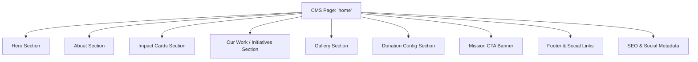
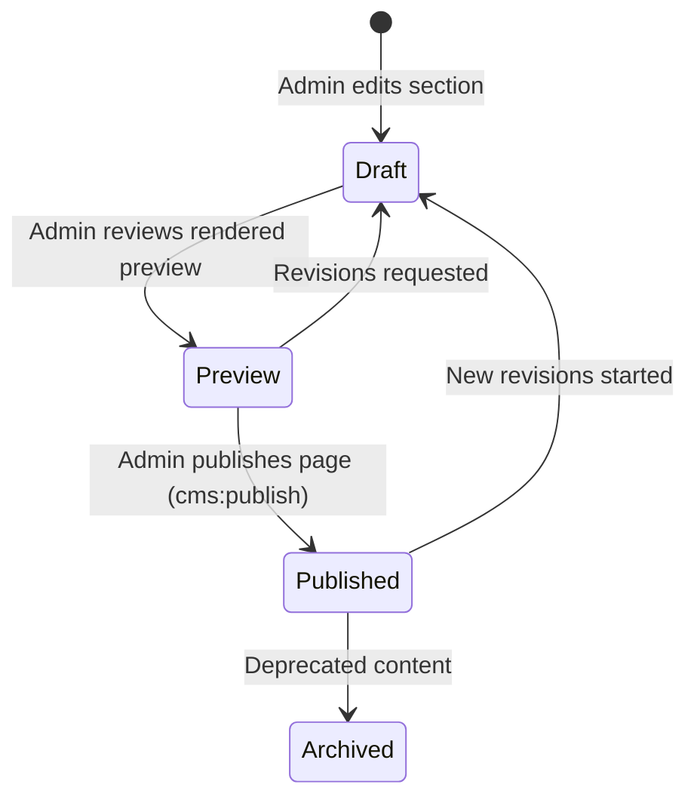

# 04 — Admin CMS & Content Management Specification

**Project:** Help A Mission Welfare Society — Backend API  
**Architecture:** Schema-Validated JSON Sections  

---

## 1. Modular CMS Architecture

The homepage and future sub-pages are composed of dynamic, reorderable sections stored in the `cms_sections` table.



---

## 2. Section JSON Schemas & Validation

Each section payload is validated against a strict server-side JSON schema before saving.

### 2.1 Hero Section (`section_key: 'hero'`)
```json
{
  "eyebrow": "Empowering Communities Across India",
  "heading": "Help A Mission Welfare Society",
  "headingHighlight": "Welfare Society",
  "body": "Dedicated to healthcare awareness, blood donation camps, and social support for underserved families.",
  "primaryCTA": {
    "label": "Donate Now",
    "url": "#donate",
    "openInNewTab": false
  },
  "secondaryCTA": {
    "label": "Our Initiatives",
    "url": "/initiatives",
    "openInNewTab": false
  },
  "heroMediaAssetId": "a1b2c3d4-...",
  "heroImageAlt": "Volunteers distributing health kits"
}
```

### 2.2 About Section (`section_key: 'about'`)
```json
{
  "label": "Who We Are",
  "heading": "Serving humanity with dignity and transparency",
  "description": "Established to bridge healthcare gaps and support community empowerment.",
  "mediaAssetId": "b2c3d4e5-...",
  "badges": [
    { "number": "10,000+", "label": "Lives Impacted" },
    { "number": "50+", "label": "Camps Organized" }
  ],
  "cta": {
    "label": "Learn More About Us",
    "url": "/about"
  }
}
```

### 2.3 Impact / Category Cards (`section_key: 'impact_cards'`)
```json
{
  "heading": "Our Core Areas of Impact",
  "cards": [
    {
      "id": "card_1",
      "title": "Blood Donation Camps",
      "description": "Connecting donors with emergency blood requirement centers.",
      "iconName": "Droplet",
      "linkUrl": "/initiatives/blood-camps",
      "sortOrder": 1
    },
    {
      "id": "card_2",
      "title": "Health Awareness Programs",
      "description": "Free preventive health checkups and wellness guidance.",
      "iconName": "HeartPulse",
      "linkUrl": "/initiatives/health-awareness",
      "sortOrder": 2
    }
  ]
}
```

### 2.4 Donation Form Settings (`section_key: 'donation_settings'`)
```json
{
  "heading": "Make a Difference Today",
  "subheading": "Your contribution directly powers our community welfare programs.",
  "suggestedAmountsMinor": [50000, 100000, 250000, 500000],
  "defaultSelectedAmountMinor": 100000,
  "customAmountEnabled": true,
  "minimumAmountMinor": 10000,
  "maximumAmountMinor": 10000000,
  "currency": "INR",
  "taxExemptInfoText": "All donations are processed securely via Razorpay.",
  "mediaAssetId": "c3d4e5f6-..."
}
```

### 2.5 SEO Metadata (`section_key: 'seo'`)
```json
{
  "title": "Help A Mission Welfare Society — Non-Profit NGO India",
  "metaDescription": "Help A Mission Welfare Society works for health awareness, blood donation, and emergency community aid.",
  "canonicalUrl": "https://helpamission.org",
  "ogTitle": "Help A Mission Welfare Society",
  "ogDescription": "Empowering communities through health drives and donor support.",
  "ogMediaAssetId": "d4e5f6a7-...",
  "robots": "index, follow"
}
```

---

## 3. Workflow & Content Lifecycle



### Publishing Invariants
1. **Audit Evidence:** Publishing any CMS section creates an entry in `audit_events` recording `actor_id`, timestamp, section key, and JSON diff.
2. **Media Protection:** Deleting a media asset that is referenced inside any `Published` CMS section or Initiative is blocked (`ON DELETE RESTRICT`).
3. **HTML Sanitization:** All text inputs and Markdown/Rich-Text fields pass through server-side DOMPurify/HTML sanitization to eliminate XSS injections.
