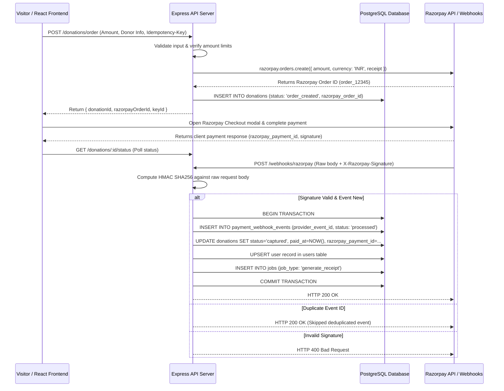

# 05 — Razorpay Payment Gateway Integration Specification

**Project:** Help A Mission Welfare Society — Backend API  
**Provider:** Razorpay  
**Currency:** INR (Amounts represented in paise integer minor units)  

---

## 1. End-to-End Payment Flow



---

## 2. Idempotency & Raw-Body Webhook Verification

### 2.1 Order Creation Idempotency
Clients **must** pass an `Idempotency-Key` UUID header when calling `POST /api/v1/donations/order`. If a request with the same key is received within 24 hours, the backend returns the existing donation order record without creating a duplicate order on Razorpay.

### 2.2 Raw-Body Webhook Signature Verification
Express route parsing for `/api/v1/webhooks/razorpay` uses `express.raw({ type: 'application/json' })` so that the exact byte stream received from Razorpay is preserved for HMAC verification.

```javascript
import crypto from 'node:crypto';

export function verifyRazorpaySignature(rawBodyBuffer, signature, webhookSecret) {
  const expectedSignature = crypto
    .createHmac('sha256', webhookSecret)
    .update(rawBodyBuffer)
    .digest('hex');
    
  return crypto.timingSafeEqual(
    Buffer.from(signature, 'utf8'),
    Buffer.from(expectedSignature, 'utf8')
  );
}
```

---

## 3. Account Provisioning from Successful Payment

When a verified webhook event `payment.captured` or `order.paid` is processed:

1. **Transaction Boundary:** Execute inside a single SQL transaction (`BEGIN ... COMMIT`).
2. **Donor Lookup/Upsert:** Match donor by `email_normalized`.
   - If donor exists: Update `last_donation_at` and increment donation stats.
   - If donor does not exist: Create new donor in `users` with `created_source = 'donation'`, generate random verification token, and queue activation email.
3. **Donation Linking:** Set `donations.user_id = user.id` and mark `status = 'captured'`.
4. **Receipt Generation:** Insert a job into `jobs` table with `job_type = 'send_donation_receipt'`.

---

## 4. Payment Reconciliation Job

A scheduled worker (`dist/jobs/reconcile-razorpay.js`) runs daily via cPanel Cron to identify pending/unconfirmed donations older than 30 minutes:

```sql
SELECT * FROM donations 
WHERE status = 'order_created' 
  AND created_at < NOW() - INTERVAL '30 minutes'
  AND created_at > NOW() - INTERVAL '7 days';
```

For each pending order, the worker queries Razorpay API `orders.fetchPayments(order_id)`:
- If payment is `captured`: Triggers server-side payment capture logic.
- If payment is `failed` or `expired`: Updates donation `status = 'failed'`.
