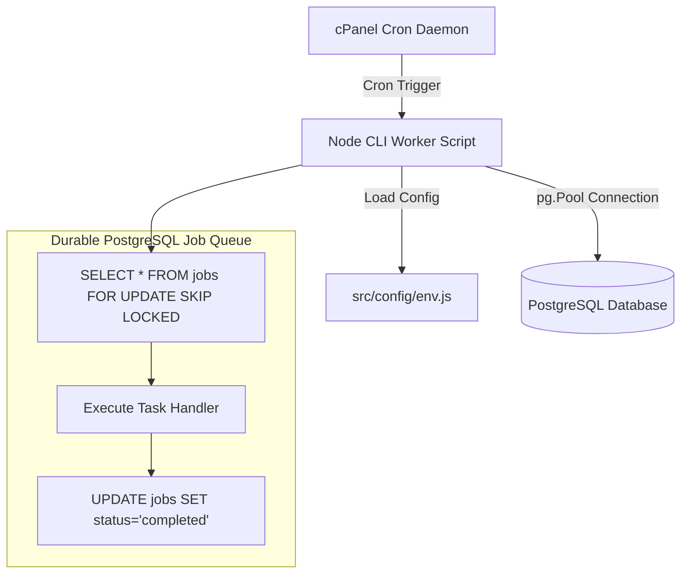
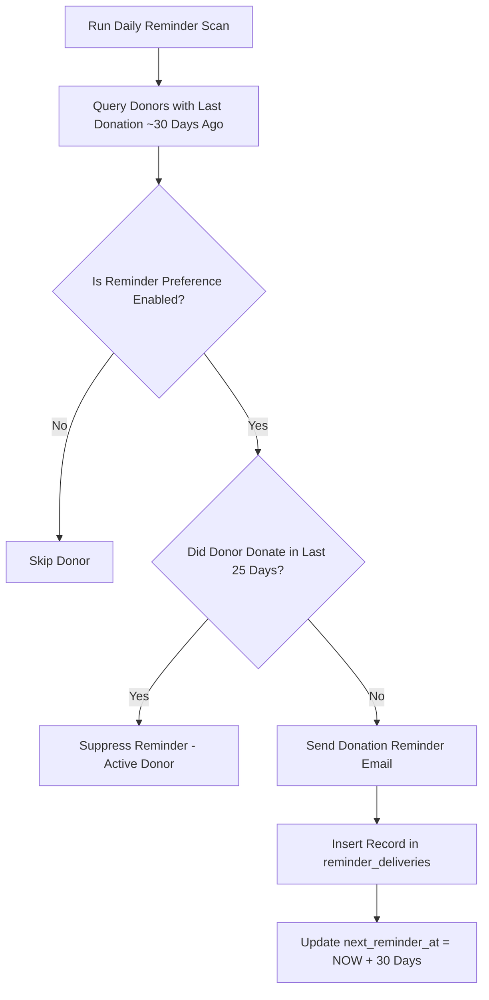

# 07 — Reminders & Background Job Worker Specification

**Project:** Help A Mission Welfare Society — Backend API  
**Architecture:** cPanel Cron Jobs + PostgreSQL Durable Job Queue (No Redis)  

---

## 1. Background Execution Architecture

Because the application is deployed on Namecheap cPanel hosting without a persistent Redis daemon, background jobs and scheduled tasks are driven by **cPanel Cron Jobs** executing dedicated Node.js CLI worker scripts.



---

## 2. cPanel Cron Configuration

| Job Function | Execution Frequency | Cron Command |
| :--- | :--- | :--- |
| **Donation Reminders** | Daily at 09:00 AM | `/usr/local/bin/node /home/<account>/app/backend/dist/jobs/send-reminders.js` |
| **Razorpay Reconciliation** | Every 6 hours | `/usr/local/bin/node /home/<account>/app/backend/dist/jobs/reconcile-razorpay.js` |
| **Expired Session Cleanup** | Daily at 02:00 AM | `/usr/local/bin/node /home/<account>/app/backend/dist/jobs/cleanup-sessions.js` |
| **Job Queue Processor** | Every 5 minutes | `/usr/local/bin/node /home/<account>/app/backend/dist/jobs/process-queue.js` |

*Note: The exact Node.js binary path depends on the cPanel environment.*

---

## 3. Atomic Queue Processing with `SKIP LOCKED`

To prevent race conditions if cron triggers overlap, job queue workers use PostgreSQL's native row-level lock clause `FOR UPDATE SKIP LOCKED`:

```javascript
export async function claimNextJob(pool, workerId, jobType) {
  const client = await pool.connect();
  try {
    await client.query('BEGIN');
    
    const selectQuery = `
      SELECT id, job_type, payload, attempt_count 
      FROM jobs 
      WHERE status = 'pending' 
        AND scheduled_for <= NOW()
        AND job_type = $1
      ORDER BY scheduled_for ASC 
      LIMIT 1 
      FOR UPDATE SKIP LOCKED;
    `;
    
    const { rows } = await client.query(selectQuery, [jobType]);
    if (rows.length === 0) {
      await client.query('COMMIT');
      return null;
    }
    
    const job = rows[0];
    const updateQuery = `
      UPDATE jobs 
      SET status = 'processing', 
          locked_at = NOW(), 
          locked_by = $1, 
          attempt_count = attempt_count + 1 
      WHERE id = $2;
    `;
    await client.query(updateQuery, [workerId, job.id]);
    
    await client.query('COMMIT');
    return job;
  } catch (error) {
    await client.query('ROLLBACK');
    throw error;
  } finally {
    client.release();
  }
}
```

---

## 4. Monthly Donation Reminder Scan Algorithm

The reminder scan script (`send-reminders.js`) identifies eligible donors who donated approximately one month ago and have not donated since:



### Eligible Donor Selection Query
```sql
SELECT u.id AS user_id, u.email, u.name, MAX(d.paid_at) AS last_donation_at
FROM users u
JOIN donations d ON u.id = d.user_id
JOIN donation_reminder_preferences p ON u.id = p.user_id
WHERE p.enabled = true
  AND d.status = 'captured'
GROUP BY u.id, u.email, u.name, p.last_reminder_sent_at
HAVING MAX(d.paid_at) <= NOW() - INTERVAL '30 days'
   AND (p.last_reminder_sent_at IS NULL OR p.last_reminder_sent_at <= NOW() - INTERVAL '25 days');
```

---

## 5. Opt-Out & Unsubscribe Management

Every reminder email includes a secure, signed single-click opt-out link:

`https://helpamission.org/reminders/unsubscribe?token=<signed_jwt_token>`

Accessing this endpoint immediately sets `donation_reminder_preferences.enabled = false` for that donor and records an audit log entry.
