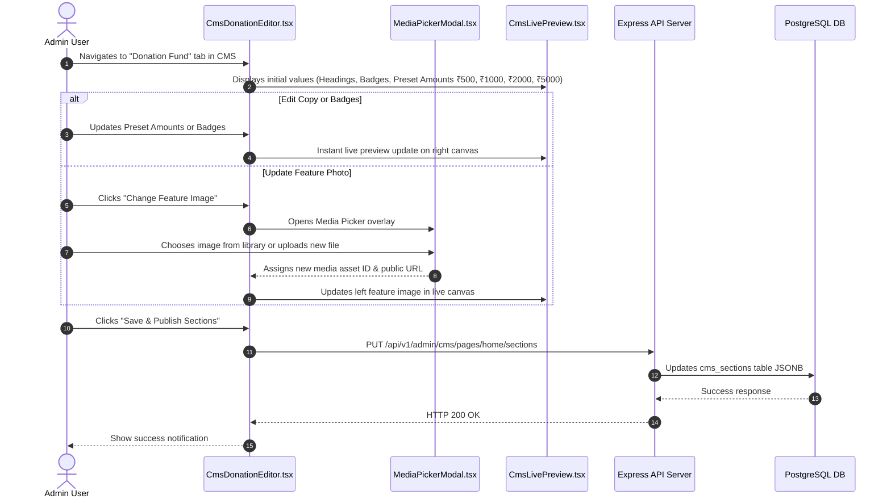

# Admin Panel CMS Implementation Plan

**Project:** Help A Mission Welfare Society  
**Target:** `help-a-mission-admin` & `help-a-mission-backend`  
**Figma Spec:** [Help-A-Mission-Welfare-Society Design](https://www.figma.com/design/GVqnM4f0Y2mOla2sRArZoK/Help-A-Mission-Welfare-Society?node-id=47-4&p=f)  
**Scope Note:** Header and Footer components are excluded from CMS (treated as static code components). All remaining body sections (including the "Make a Difference Today / Donation Fund" section) and SEO metadata are managed dynamically via the Admin Panel CMS.  
**Status:** Updated Implementation Blueprint  

---

## 1. Executive Summary & Scope

This document defines the architecture, data contracts, UI components, live preview workflow, and step-by-step implementation plan for the **Content Management System (CMS) on the Admin Panel**.

### Scope Inclusions & Exclusions
* **EXCLUDED FROM CMS:** Header navigation bar, logo, static nav links, header CTA, footer layout, copyright, and static footer links.
* **INCLUDED IN CMS (Managed via Admin Panel):**
  1. Hero Banner (`hero`)
  2. About Us & 4 Impact Cards (`about`)
  3. Our Work / Initiatives Summary (`initiatives`)
  4. Moments That Matter / Gallery Grid (`gallery`)
  5. **Make a Difference Today / Donation Fund (`donation_settings`)** *(Detailed Deep-Dive below)*
  6. Be Part of Our Mission Action Banner (`mission_cta`)
  7. SEO & OpenGraph Metadata (`seo`)

---

## 2. Deep-Dive: "Make a Difference Today / Donation Fund" Section

The **"Make a Difference Today / Donation Fund"** section consists of a split layout:
- **Left Side (Informational Content & Visuals):** Eyebrow tagline, main heading, body paragraph, 3 highlight badges with icons, and a feature photo.
- **Right Side (Interactive Donation Fund Card):** Card title, subtitle, preset amount buttons, custom amount toggle, and payment button configuration.

```mermaid
graph LR
    subgraph CMS Managed Fields (donation_settings)
        subgraph Left Side
            E[Eyebrow: 'SUPPORT OUR MISSION']
            H[Heading: 'Make a Difference Today']
            B[Body Copy]
            Badges[3 Highlight Badges: Icon + Title]
            Image[Feature Image Asset ID]
        end
        subgraph Right Side
            CT[Card Title: 'Donation Fund']
            CS[Card Subtitle]
            Presets[Preset Amounts: ₹500, ₹1000, ₹2000, ₹5000]
            Default[Default Selection: ₹1000]
            CustomToggle[Custom Amount Enabled: true]
            ButtonText[Button Label: 'Donate']
        end
    end
```

### 2.1 JSON Schema Data Contract (`section_key: 'donation_settings'`)

```json
{
  "eyebrow": "SUPPORT OUR MISSION",
  "heading": "Make a Difference Today",
  "body": "Your contribution helps us organize health camps, support needy individuals and create awareness in communities.",
  "badges": [
    { "id": "b1", "icon": "Heart", "label": "Better Healthcare" },
    { "id": "b2", "icon": "Users", "label": "Stronger Communities" },
    { "id": "b3", "icon": "GraduationCap", "label": "Brighter Futures" }
  ],
  "featureMediaAssetId": "a1b2c3d4-...",
  "featureMediaUrl": "/storage/public/donation_globe.jpg",
  "cardTitle": "Donation Fund",
  "cardSubtitle": "Every contribution counts. Choose an amount or enter your own.",
  "suggestedAmountsINR": [500, 1000, 2000, 5000],
  "defaultAmountINR": 1000,
  "customAmountEnabled": true,
  "minAmountINR": 100,
  "maxAmountINR": 100000,
  "donateButtonLabel": "Donate"
}
```

---

## 3. Figma Layout to CMS Section Mapping

| Section Key | Section Type | Content Scope | Managed Elements |
|---|---|---|---|
| `hero` | `hero` | Main Hero Header | Eyebrow Badge ("FOR DEDICATED WORK"), Main Heading, Sub-heading/Highlight, Primary & Secondary CTAs, Background Media Asset |
| `about` | `about` | About Society & Core Feature Cards | Eyebrow ("ABOUT US"), Main Heading, Body Paragraph, Highlight Badge ("Serving society for 10+ years"), Main Media Asset, 4 Feature Cards (Icon, Title, Description) |
| `initiatives` | `initiatives` | Our Work Overview | Section Eyebrow ("OUR WORK"), Heading, Sub-description, Number of Featured Initiatives displayed |
| `gallery` | `gallery` | Moments That Matter | Section Eyebrow ("GALLERY"), Heading, Sub-description, Selected Media Assets / Gallery Items |
| **`donation_settings`** | **`donation_settings`** | **Make a Difference / Donation Fund** | **Left eyebrow, heading, body description, 3 icon badges, feature photo, right card title, subtitle, preset amount buttons (`₹500`, `₹1000`, `₹2000`, `₹5000`), default selection, custom toggle, button text** |
| `mission_cta` | `mission_cta` | Bottom Action Banner | Tagline ("BE A PART OF OUR MISSION"), Heading, Sub-heading, CTA Button Label & Link |
| `seo` | `seo` | Page SEO & Social Metadata | Meta Title, Meta Description, OG Share Image Asset, Keywords, Canonical URL |

---

## 4. Architecture & Data Contracts

### 4.1 Backend Database Model
The backend uses Knex + PostgreSQL with schema-validated JSONB columns:

- `cms_pages`: Stores `id`, `slug` (`'home'`), `title`, `status` (`'draft' | 'published'`), `seo_json`.
- `cms_sections`: Stores `page_id`, `section_key`, `section_type`, `sort_order`, `content_json` (JSONB), `status`, `version`.
- `media_assets`: Holds uploaded images with public/private URLs, mime types, and dimension metadata.

### 4.2 Key API Endpoints

```typescript
// GET Admin CMS Page & Sections
GET /api/v1/admin/cms/pages/:slug
Header: Authorization: Bearer <token>
Response: { success: true, data: { id, slug, title, status, sections: [...] } }

// PUT Admin CMS Page Sections Update
PUT /api/v1/admin/cms/pages/:slug/sections
Header: Authorization: Bearer <token>
Body: {
  sections: [
    { sectionKey: "hero", sectionType: "hero", sortOrder: 1, contentJson: { ... } },
    { sectionKey: "about", sectionType: "about", sortOrder: 2, contentJson: { ... } },
    { sectionKey: "initiatives", sectionType: "initiatives", sortOrder: 3, contentJson: { ... } },
    { sectionKey: "gallery", sectionType: "gallery", sortOrder: 4, contentJson: { ... } },
    { sectionKey: "donation_settings", sectionType: "donation_settings", sortOrder: 5, contentJson: { ... } },
    { sectionKey: "mission_cta", sectionType: "mission_cta", sortOrder: 6, contentJson: { ... } },
    { sectionKey: "seo", sectionType: "seo", sortOrder: 7, contentJson: { ... } }
  ]
}

// POST Media Upload for CMS
POST /api/v1/admin/media/upload
Header: Authorization: Bearer <token>, Content-Type: multipart/form-data
Body: file, visibility: "public"
```

---

## 5. Admin Panel UI & Component Structure

The Admin Panel (`help-a-mission-admin`) features a split-view interactive CMS editor with section tabs, granular forms, media selector modal, and dynamic live preview.

### 5.1 UI Directory Layout (`help-a-mission-admin/src/`)

```text
src/
├── components/
│   ├── cms/
│   │   ├── CmsSectionTabs.tsx       # Sidebar/Top navigation for section switching
│   │   ├── CmsHeroEditor.tsx        # Form for Hero Section
│   │   ├── CmsAboutEditor.tsx       # Form for About Us & 4 Feature Cards
│   │   ├── CmsInitiativesEditor.tsx # Form for Initiatives section copy & settings
│   │   ├── CmsGalleryEditor.tsx    # Form & Image Picker for Gallery
│   │   ├── CmsDonationEditor.tsx   # Granular Form for "Make a Difference / Donation Fund" (Copy, Badges, Presets, Image Picker)
│   │   ├── CmsMissionCTAEditor.tsx # Form for bottom CTA Banner
│   │   ├── CmsSEOEditor.tsx        # Form for Meta title, description & OG Image
│   │   ├── MediaPickerModal.tsx    # Asset selector overlay connected to media API
│   │   └── CmsLivePreview.tsx      # Interactive Figma-styled split-view preview (renders body with static header/footer framing)
├── pages/
│   └── CmsPage.tsx                 # Master page container managing state, API load/save, preview toggle
├── services/
│   └── api.ts                      # Admin API client methods for CMS & Media
└── types/
    └── cms.ts                      # Comprehensive TypeScript interfaces for all 7 CMS sections
```

---

## 6. Detailed Component Workflow & Operation Lifecycle



---

## 7. Implementation Phasing & Milestones

### Phase 1: Data Contracts & TypeScript Definitions
- Define strong TypeScript interfaces in `help-a-mission-admin/src/types/cms.ts` matching all 7 CMS section payloads including `CmsDonationSection`.

### Phase 2: Modular Section Editors & Media Selector
- Build `CmsDonationEditor.tsx` with controls for left copy, highlight badges, right card title, preset amount chips adder/reorder, and media selector.
- Create `MediaPickerModal.tsx` for visual image browsing, search, and instant file uploads.

### Phase 3: Interactive Live Split-View Preview
- Build `CmsLivePreview.tsx` reflecting exact Figma styling (matching typography, teal pills `#00a884`, form layout, side photo, static header/footer framing).

### Phase 4: Master Integration & Backend Synchronization
- Upgrade `CmsPage.tsx` with section tab navigation, draft state management, dirty-state warning before navigating away, and optimistic updates.
- Connect save handler to `adminApi.updateCmsSections('home', sections)`.

### Phase 5: Verification & End-to-End Testing
- Validate public API endpoint (`GET /api/v1/public/home`).
- Verify Razorpay frontend donation integration uses preset values from `GET /api/v1/public/home`.
- Verify audit log recording on section update.
